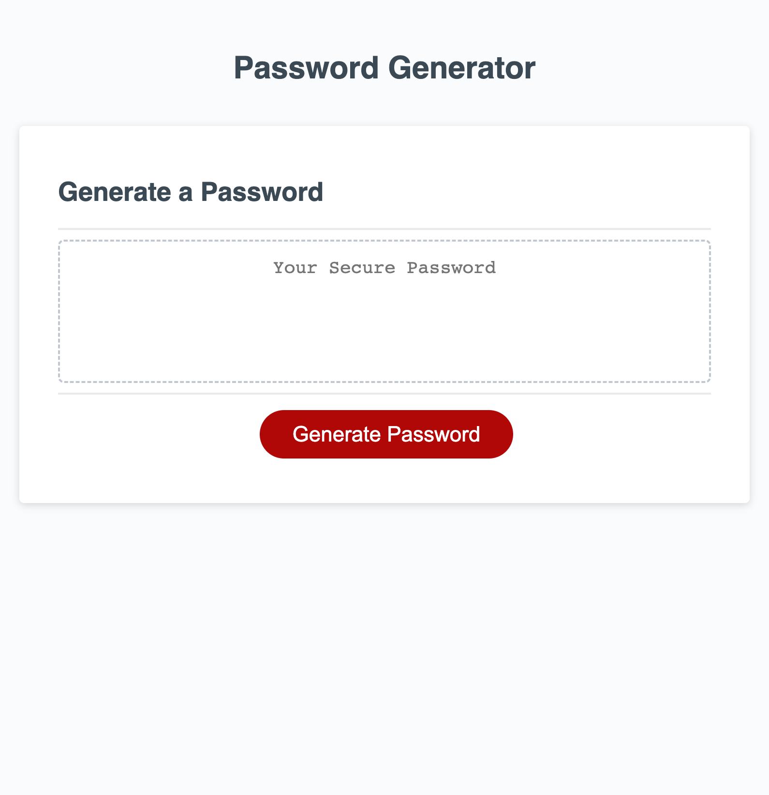

# Random Password Generator

## Description
This web application was created to generate a random password based on user selected criteria to provide security

## Installation
N/A

## Usage
The webpage contains a container where the user's password will be generated and a button that will prompt the user to enter the criteria they wish to include for their password. The user is prompted how long they want their password to be and whether to include uppercase, lowercase, numeric, and/or special characters. Once those criteria have been selected, a password is generated.

You can view a screenshot of the webpage below and visit the website [here](https://jakefair97.github.io/password-generator/)

## Credits
The webpage was designed by Xander Rapstine (@Xandromus)

## License
Please refer to the LICENSE in the repo.
